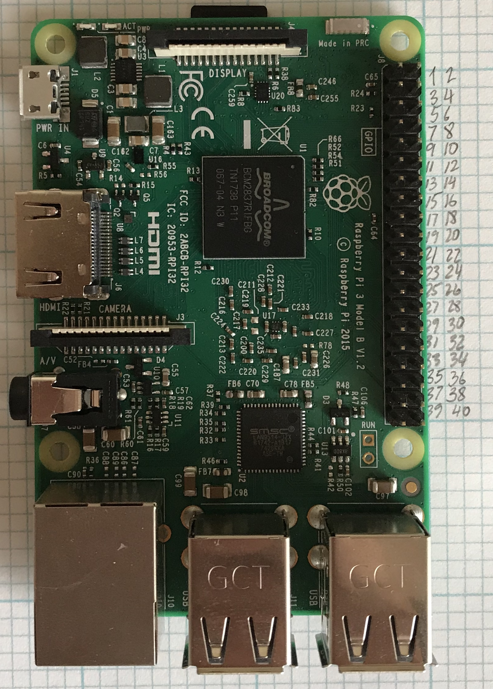
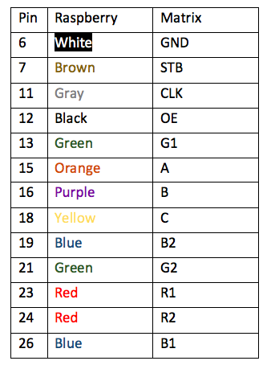
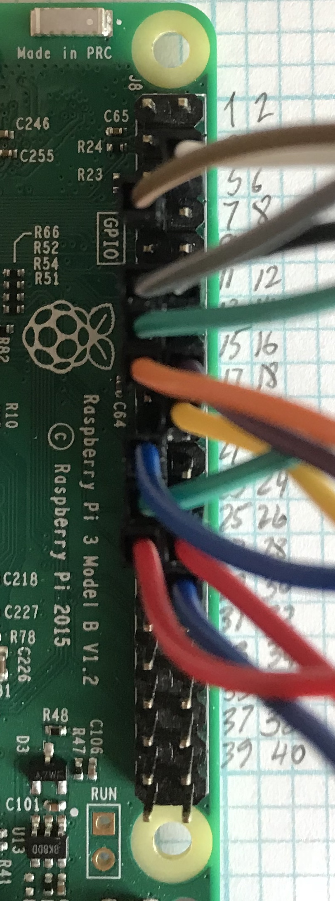
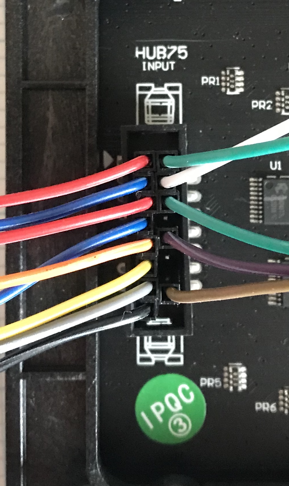
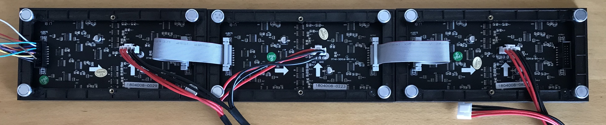
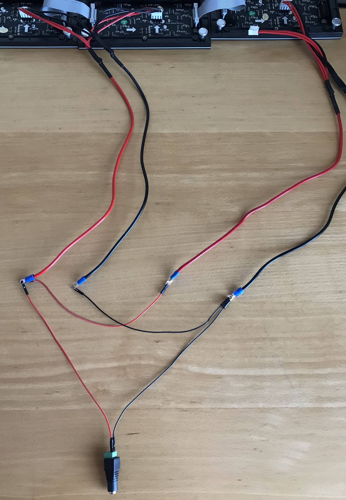

News Ticker: Controlling up to three chains of 16x32 RGB LED displays using Raspberry Pi.
==================================================

Contributers
--------

The LED-matrix library is (c) Henner Zeller <h.zeller@acm.org>, licensed with
[GNU General Public License Version 2.0].

RSS parser was initally developed by chubbyemu. 

Overview
--------
The following project utlizes three 16x32 RGB LED matrix panels that are chained
in order to display a scrolling news feed acquired from `RSS` sources.

Required Materials
-------------------
1. Raspberry Pi 3 (Ubuntu Mate)
  1.1 5V power supply
2. Adafruit 16x32 LED matrix (3)
  2.1 5V power supply
3. F-F jumper wires (13)
4. M-M jumper wires (4)
5. Female DC power supply

Connecting Raspberry to LED matrix
------------

1. Grab Raspberry Pi and note the pins

2. Grab 1 Adafruit 16x32 LED matrix and note the pins

3. Connect Rasberry

4. Connect LED matrix

5. Chain 3 displays

6. Wire the chain

